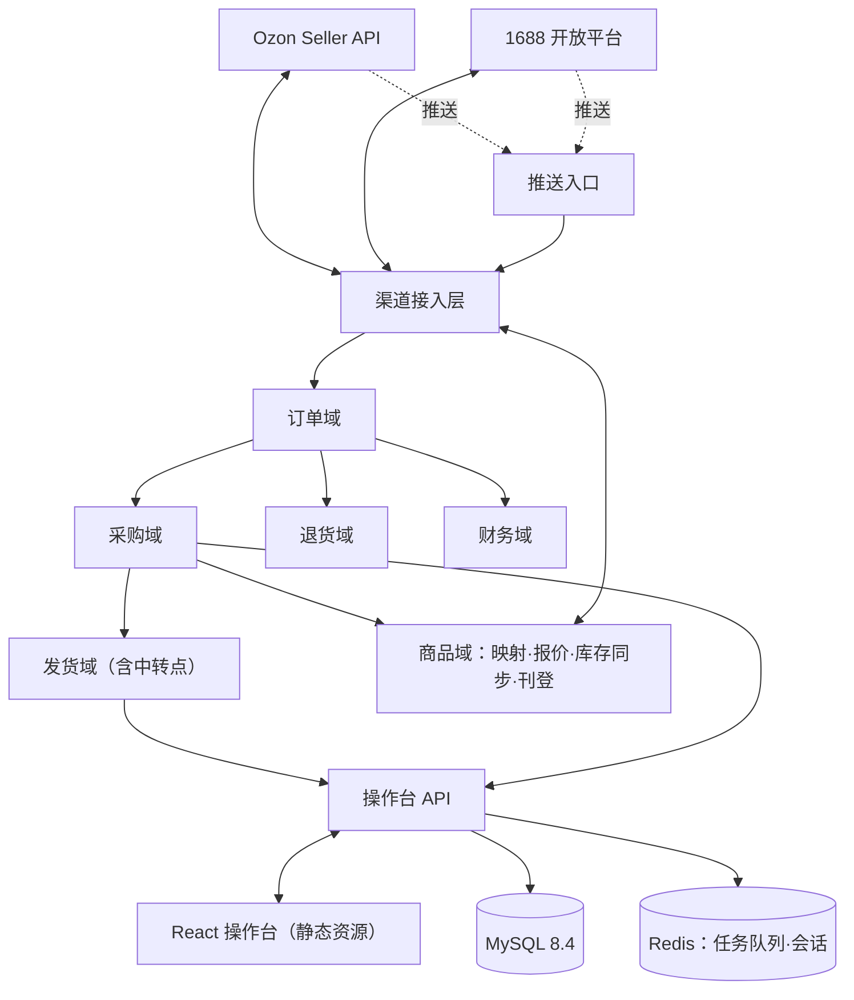

# spec-fulfillment-hub —— Ozon × 中国货源 · 履约中台（总 spec / 总纲）

> Issue: 待开（本 spec 合并后按波次开实施 issue，届时回填号）
> 状态：**v1.3**（2026-10-07：v1.1 调研修订——纠正 1688 下单通道、物流单号口径，补入 Ozon 密钥有效期 / 限流 / 推送等新事实，新增 4 条机制，技术栈与仓库结构定稿并落 ADR；v1.2 处置重审 24 条发现，见 §14；v1.3 拆出 S1 的 6 份子 spec，见 §12.3；包划分与依赖规矩落 ADR）
> **设计权威 = 本文（总纲）**。S1 拆成 6 份子 spec（拆分地图见 §12.3；2026-10-07 owner 拍板，取代同日较早的「不拆子 spec」）；子 spec 只写落地、指向本文，与本文冲突时以本文为准。S2–S4 轮到时再定拆法。
> 立项日期：2026-10-07 ｜ 需求方：owner
> 长期决定见 §4.1 所列生效 ADR（本文只链接、不复述决定正文；ADR 与本文不一致时以 ADR 为准）。
> 调研依据：本仓 [Issue #1](https://github.com/Strelizialeomon/ozon-dropship/issues/1)（三轮调研，含全部来源链接）。本文只放结论与设计。

**证据分级**（外部事实的来源标注）：

| 标记 | 含义 |
|---|---|
| 【官方】 | 平台官方文档 / 官方帮助页 / 官方开发者频道（链接见 Issue #1） |
| 【第三方】 | 卖家社区 / ERP 文档口径，仅作线索 |
| 【未验】 | 尚无证据，落地前必须核实 |

---

## 1. 这个 spec 管什么

**管**：整套履约中台的设计——需求、总体架构与技术栈、机制、数据模型、渠道对接、操作台、验收标准、风险、波次与前置动作。

**不管**（出界）：

- 实施排期与人力分配——实施期在各波次的 issue 里谈
- 服务器放在哪（国内 / 香港 / 新加坡）——要先实测线路，实施期定（见 §13.2）
- 选品与定价策略——业务侧的事，系统只提供工具

---

## 2. 需求（owner 已确认）

### 2.1 业务背景

- 在 Ozon（俄罗斯主流电商平台）经营 **10+ 家店铺**（多执照矩阵）。
- 买家在 Ozon 下单后，从中国货源平台**串货/代发**（1688 / 拼多多 / 淘宝）。
- 现状：拉单 → 找货 → 下单 → 回填单号 → 售后的全链路靠人工搬运，量上来后撑不住。

### 2.2 需求清单

| # | 需求 | 出处 |
|---|---|---|
| R1 | Ozon 订单自动同步，支持 10+ 店 | owner 拍板 |
| R2 | 1688 **自动下单**：买家自用版 / 跨境自用版两条官方通道都接、可任意选择（见 §3.2） | owner 拍板 + 调研 |
| R3 | 拼多多 / 淘宝**人工辅助**：系统备料 + 人工下单 + 单号回填 | owner 拍板 |
| R4 | 发货：中转点贴单、备货、面单、按物流类型回传单号、轨迹 | owner 拍板 |
| R5 | 退货处理流程（含仅退款 / 销毁等处置） | owner 拍板 |
| R6 | 财务对账（每单毛利） | owner 拍板 |
| R7 | 商品采集 / 刊登（1688 → Ozon） | owner 拍板 |
| R8 | **手动与自动双轨**——每类动作都有手动入口 | owner（Issue #1 第二轮评论：「手动操作与 API 对接都需要做（双轨）」） |
| R9 | 发货模式兼容：rFBS / FBP / 俄本土店，按店配置 | owner（同上：「可能都要考虑」） |
| R10 | 中转点两种都支持：货代 / 物流商代打包仓、自有仓，按店配置 | owner 2026-10-07「两种都有」 |

### 2.3 明确不做（YAGNI，owner 2026-10-07 认可）

RPA / 爬虫（违规 + 封号）；自动改价跟卖（库存同步只动库存、不动价格，见 §5.10）；自建物流；移动端 App；多租户 SaaS（自用）；俄语翻译（人工或第三方工具）。

---

## 3. 外部能力现状（调研结论）

### 3.1 Ozon 侧：全链路 API 齐备【官方】

- 认证：每店一套 `Client-Id` + `Api-Key`（Seller Center → Settings → Seller API 自取）。
- **密钥会过期**：2026-09-03 起新建的 Api-Key **只有 3 个月有效**；key 带角色（可调哪些方法），可绑定「允许的网络」（出口 IP）；`/v1/roles` 可查到期时间【官方】。
- **限流**：每个 Client-Id 所有方法合计 ≤ **50 次/秒**（2025-05 起）；部分接口另有单独限额（如同一商品库存 30 秒只能改 1 次、单商品改价每小时 10 次）；超限返回 429，2026-09-25 起带 `Retry-After`【官方】。库存 30 秒一次，第三方口径是按「商品 + 仓库」计，未逐字核。
- **商品操作统一限流**（2026-02-24 起）：含 `/v3/product/import`（S4 刊登要用）在内 4 个方法合计 ≤ 3 万次操作/分钟，超限返回 429 且**整单拒绝**；库存接口不在其中【官方，经第三方逐字转载】。
- **推送**：官方提供推送通知（新单、取消、状态变更、截止时间变更、库存等）；posting 类通知覆盖 FBS / rFBS，**FBP 未见**（FBO 另有专用类型，本项目不用）。接收端应答 < 1.5 秒算正常、1.5–2.5 秒算不稳定、≥ 2.5 秒算不可用，**连续三天不可用即停推**；新订单通知可能延迟到达【官方】。
- 中国跨境店只有 **rFBS / FBP** 两种发货模式；FBO 不面向跨境；一张执照最多 **6 个账户**。
- **物流单号不是我们给的**：走 Ozon 合作物流时，备货后约 30 分钟由 Ozon 自动生成单号和面单，卖家不能改；是否需要卖家回传单号看 posting 的 `tpl_integration_type`（见 §7.4）【官方】。
- 中国卖家 **结算币种是 CNY**；新财务接口每个金额都带 `currency_code`【官方】。
- Ozon 建议用**独占静态 IP**、禁止走 VPN【官方】。
- 拉单接口有版本迭代（v3 拉单 2026-08-31 关停、财务旧接口 2026-09-08 关停）——对接时以官方文档现行版号为准。

### 3.2 1688 侧：唯一支持买家侧自动下单的货源平台【官方】

买家侧下单接口分属三个官方「解决方案」，门槛不同（2026-10-07 已对 1688 官方方案页原文核实）：

| 方案 | 下单接口 | 门槛 | 本项目 |
|---|---|---|---|
| 代发解决方案（分销买家版） | `alibaba.trade.fenxiaoOrder.create` | 正式上线 1 个月后**月日均回流 ≥ 1 万单**；日活 ≥ 1 万、月活 ≥ 2 万 | ❌ 量级不够（200–1000 单/天） |
| 采购解决方案（买家自用版） | `alibaba.trade.fastCreateOrder` | 1688 **L2 以上买家**；只能对**下过单的老商家**下单（方案页原文）。另据 1688 接入指南：不进聚石塔、最多授权 5 个自有企业账号【未验】 | ✅ 通道一（默认） |
| 跨境综合解决方案（自用） | `alibaba.trade.createCrossOrder` | 由 1688 跨境运营**加白名单**；考核两项：**月度确收 GMV ≥ 160,000 元**，且平均每次调用确收 GMV ≥ 0.5 元；不达标会被治理 | ✅ 通道二 |

- 两条可用通道都支持免密支付 `protocolPay.*`（先扣诚E赊、失败再走支付宝；额度上限未查到）。
- **消息推送**：订单、物流、商品（含库存变化、商品失效）都有官方推送，HTTP 回调带 `_aop_signature` 可验签；**后发的消息可能先到**；失败消息可补拉（`push.cursor.messageList` / `push.message.confirm`）。
- 鉴权：`access_token` 10 小时有效，用 `refresh_token` 续；`refresh_token` 有效期官方两处写法不一（随订购周期 / 半年）→ 按会过期处理（§5.8）。
- 官方 SDK 有 Java / PHP / .Net / Python，**没有 Go**；签名为 HMAC-SHA1，自己实现。
- **前置**：企业实名必过（营业执照 + 法人 + 对公账户）；下单类权限按月续订。

### 3.3 拼多多 / 淘宝：无官方买家侧 API【官方】

- 淘宝帮助中心明示「不提供买家接入开发相关的 API」；`taobao.fenxiao.*` 只剩查询与供应商侧操作，「淘分销」是分销商在淘宝发商品，都不能替我们下单。拼多多开放平台无买家角色，多多批发无开放 API（2026-10-07 复查）。
- → 这两家只能**人工辅助**：系统生成备料单，人工去平台下单，回填单号。

### 3.4 现成 ERP 对照（自研的基线）

- 妙手 / 店小秘 / 芒果 / 通途：都支持 Ozon 拉单 + 1688 代发，但**全是半自动**（采购下单需人工确认/付款）；无一支持「10+ 店全平台全自动」。
- 结论：owner 拍板**直接自研**（见 §4.1 ADR）。ERP 对照数据留在 Issue #1 作 Plan B。

---

## 4. 总体架构



- **形态**：Go 模块化单体，按域分包；asynq 后台任务与 HTTP 服务**同进程**；单机部署。
- **包划分**（目录骨架照 hi-backend 标准档；**包之间的依赖规矩按 Go 官方**，见 [ADR-20261007-go-package-deps](../decisions/2026-10-07-go-package-deps.md)）：
  - **业务包** `internal/<域>/`：`store`（店铺与凭据管理）/ `order` / `purchase`（含人工渠道备料单）/ `shipment`（含中转点）/ `catalog`（映射、报价、库存同步、采集刊登）/ `returns` / `finance`。各包自带操作台接口的 handler（不设单独的操作台 API 层）。
  - **外部接口客户端**：`internal/ozon`、`internal/alibaba`（自写，见 §4.1）。
  - **基础设施** `internal/infra/`：DB、Redis 与 asynq 任务、限流、凭据保险箱、审计、通知、推送入口校验。
  - `internal/middleware/`（登录与角色）、`internal/router/`（唯一路由注册）、`cmd/api/`（启动装配）。
  - **依赖方向**（只许单向、禁循环）：`infra` ← `ozon` / `alibaba` ← 业务包；业务包之间 `store`、`catalog` 在下，`order` 依赖 `store`，`purchase` 依赖 `order` 与 `catalog`，`shipment` 依赖 `order`。反方向的触发（如新订单要生成采购任务）走 asynq 任务，不反向 import。
- **数据流**：推送 / 轮询拉单 → 订单入库 → 匹配供应商映射 → 生成采购任务 → 执行（1688 自动 / 人工渠道备料；**收货地址 = 中转点**）→ 国内段到中转点签收 → 备货 + 取 Ozon 面单贴单 → 交承运商（按 `tpl_integration_type` 决定是否回传单号）→ 轨迹跟踪 → 对账。

### 4.1 技术栈、仓库与部署（定稿，2026-10-07 owner 逐项拍板）

生效 ADR（决定正文只在 ADR 里，本节只做索引）：

| ADR | 一句话 |
|---|---|
| [ADR-20261007-build-in-house](../decisions/2026-10-07-build-in-house.md) | 直接自研，不以现成 ERP 起步 |
| [ADR-20261007-sourcing-integration](../decisions/2026-10-07-sourcing-integration.md) | 1688 走两条自用通道；拼多多 / 淘宝人工辅助、不做 RPA |
| [ADR-20261007-repo-layout](../decisions/2026-10-07-repo-layout.md) | 一个总仓，`backend/`、`frontend/` 两个子项目依赖分开 |
| [ADR-20261007-backend-stack](../decisions/2026-10-07-backend-stack.md) | Go + gin + GORM + MySQL 8.4 + Redis/asynq 等后端选型 |
| [ADR-20261007-frontend-stack](../decisions/2026-10-07-frontend-stack.md) | React + Bun + Rsbuild + 声明式 React Router + jotai + shadcn/ui + Axios |
| [ADR-20261007-deployment](../decisions/2026-10-07-deployment.md) | 单机、不用 Docker；Caddy 管 HTTPS 和前端静态资源；systemd 托管 Go |
| [ADR-20261007-go-package-deps](../decisions/2026-10-07-go-package-deps.md) | Go 包依赖按官方：可直接 import、只许单向、禁循环；接口放使用方 |

部署拓扑（一台 Linux 服务器）：

```
公网 ──443──▶ Caddy（自动 HTTPS）
               ├─ /          → 前端静态资源（找不到文件回退 index.html）
               ├─ /api/*     → Go 程序（systemd 托管）
               └─ /hooks/*   → Go 程序：Ozon / 1688 推送入口
Go 程序 ──▶ MySQL 8.4（本机）、Redis（本机，开 AOF）
```

- **对接方式**：不出接口文档、不用代码生成——接口以后端 Go 代码为准，前端类型与 Axios 调用全部手写（前后端同一人维护）。
- 服务器需要**固定公网 IP + 域名**：Ozon 推送要公网 HTTPS 地址；Ozon 密钥要绑出口 IP（§3.1）。

---

## 5. 机制（11 条）

**机制清单**：

| # | 机制 | 解决什么 / 没有它会怎样 | 批准 |
|---|---|---|---|
| 5.1 | 采购任务 | 手动 / 自动统一成一种任务；没有它双轨分叉，R8 落不了地 | owner 2026-10-07「全要」 |
| 5.2 | 订单状态机 + 异常队列 | 日千单靠人记状态必乱；异常单被淹没 | 同上 |
| 5.3 | 供应商映射 + 报价 | 没有它每单人工找货比价 | 同上 |
| 5.4 | 凭据保险箱 | 密钥散落，泄一个全线崩 | 同上 |
| 5.5 | 调度 + 限流重试 | 手动刷单、触发限流甚至封禁；Redis 崩溃丢任务 | 同上 |
| 5.6 | 对账口径 | 月底对不上账 | 同上 |
| 5.7 | 中转点交接 | 货到中转点认不出对应哪单、面单在哪 | owner 2026-10-07「两种都有」 |
| 5.8 | 凭据到期告警 | Ozon 密钥 3 个月过期，到期当天全店断单 | owner 2026-10-07 勾选 |
| 5.9 | 推送 + 轮询混合 | 只靠轮询延迟高、调用多；只靠推送丢消息即丢单 | owner 2026-10-07 勾选 |
| 5.10 | 库存同步防断货 | 货源断货后 Ozon 继续卖 → 只能取消 → 逼近 40% 取消率封号线 | owner 2026-10-07 勾选 |
| 5.11 | 审计留痕 | 自动与手动操作都可追溯；没有它出了错查不到是谁、哪一步改的 | v1.0 起即在横切层（owner 认可方案）；v1.2 补入清单 |

### 5.1 采购任务（PurchaseTask）——统一「去哪买、谁去买」

- **对象**：`purchase_tasks`（一单可拆多任务：多供应商 / 多平台）。字段：order_id、supplier_offer_id、channel、executor_type(`auto`/`manual`)、payload（下单参数快照）、status、assignee、deadline、idempotency_key。
- **状态机**：`pending → executing → ordered → paid → shipped（货源已发国内段）→ closed（中转点已签收）`；任一步失败或超时 → `exception`。
- **执行器**：`auto` = 1688 API 下单（通道按货源配置：买家自用版 / 跨境自用版，S2 起含免密支付）；`manual` = 生成备料单给人工，人工执行后回填结果。
- **新商家首单**：买家自用版只能对下过单的老商家下单 → 新商家的第一单走 `manual`，之后同商家可转 `auto`。
- **下单防重**：调下单接口前先把任务置 `executing` 并落幂等键；重试（含进程崩溃后重启）前，先查 1688 买家订单核对是否已下过，**查到就补记、不再下单**。
- **支付防重**：免密支付超时或失败 → 先回查该订单支付状态再决定是否重试；官方建议失败最多重试 3 次、不无限重试，仍失败进异常池。
- **没有它会怎样**：手动/自动两套流程分叉，R8 双轨落不了地。

### 5.2 订单状态机 + 异常队列

- **内部状态**（`orders.status`）：`new → purchasing → purchased → inbound（国内段在途）→ at_relay（中转点已签收）→ handed_over（已备货、贴单、交运）→ in_transit → delivered → completed`；旁支 `cancelled` / `returned`。
- **Ozon 状态原样另存**（`ozon_status` / `ozon_substatus`）。`new → … → at_relay` 由本系统的采购与中转流程推进；Ozon 状态只按下表驱动内部动作【官方枚举】（FBS / rFBS；FBP 见 §13.1）：

  | Ozon status | 内部动作 |
  |---|---|
  | `awaiting_registration` / `acceptance_in_progress` / `awaiting_approve` / `awaiting_verification` | 建单为 `new`，标「平台未放行」，**不生成采购任务** |
  | `awaiting_packaging` | 允许生成采购任务；内部状态由本系统流程推进（Ozon 状态不反向改写） |
  | `awaiting_deliver` | → `handed_over`（已备货待交运） |
  | `delivering` / `driver_pickup` / `sent_by_seller` | → `in_transit` |
  | `delivered` | → `delivered` |
  | `cancelled` / `not_accepted` | → `cancelled` |
  | `arbitration` / `client_arbitration` | 进异常池 |
  | 表外的任何状态 | 进异常池并告警（防官方新增状态被静默吞掉） |

- **拆单**：一个 Ozon 订单可拆成多个 posting（多包裹），以 posting 为单位建单，记 `order_number` 与 `parent_posting_number`。
- **备货结果要复核**：`/v4/posting/fbs/ship` 返回 200 不代表成功，要再查 `substatus` 不是 `ship_failed`【官方】。
- **异常判定（自动进池 + 通知）**：超时未采购；1688 下单失败；采购价变动超阈值；地址校验失败；发货截止（备货期最长可设 5 天【官方】）临近；国内段或中转点停滞；物流轨迹停滞；备货 `ship_failed`；仲裁。
- **没有它会怎样**：日 200–1000 单靠人记状态必乱；异常单被淹没。

### 5.3 供应商映射 + 报价表

- **对象**：
  - `supplier_offers`——货源商品（平台、商品 ID、规格 ID、链接、采购价、境内运费、库存、下单通道 `self_use`/`cross_border`/`manual`）。
  - `offer_links`——**按店**映射：`store_id + ozon_offer_id` ↔ 货源商品，可挂多个货源并按 `priority` 排主备（同一 offer_id 在不同店是不同商品）。
- 下单时把当时价格**快照**进 `purchase_orders`，价格变动可追溯、可告警。
- **没有它会怎样**：每单人工找货比价，自动化无从谈起。

### 5.4 凭据保险箱

- 所有密钥（Ozon `Api-Key` × N 店、1688 应用密钥与 token）**加密存储**：用 Tink-go 加密，密文绑定所在表与行（挪到别的行解不开）；主密钥由 systemd 加密凭据注入，**不进 git、不放环境变量**。
- 按店隔离；操作台只显示脱敏尾号；读取与轮换记审计；到期管理见 §5.8。
- **没有它会怎样**：密钥散落，泄一个全线崩。

### 5.5 调度 + 限流重试

- **任务载体**：asynq（Redis）承载异步任务与定时任务，worker 与 HTTP 服务同进程。
- **防丢任务**：Redis 开 AOF 持久化；写库与入队不在同一事务 → 定时**补投扫描**：业务记录停在「待处理」超时的，重新入队；每个任务带幂等键，重复执行无副作用。
- **限流**：每店 × 每接口一个令牌桶——总闸按每 Client-Id 50 次/秒，另叠加单接口限额（§3.1）；遇 429 按 `Retry-After` 等待；其余失败指数退避重试，**次数有上限**（默认 3 次），用尽进异常池。
- **幂等入库**：按 `store_id + posting_number` upsert。
- **没有它会怎样**：手动刷单、触发限流甚至封禁；Redis 崩溃丢任务。

### 5.6 对账口径

- 每单一条 `order_settlements`：`回款 revenue − 采购成本 purchase_cost − 境内运费 domestic_freight（货源 → 中转点）− 头程/物流费 logistics_fee（中转点 → 买家）− 平台佣金 commission = 毛利 gross_profit`。
- **币种**：每个金额都带币种。中国跨境店按 CNY 结算，财务接口直接给 `currency_code`，不用自己折算；俄本土店（RUB）出报表时按下单日俄央行汇率折算（Ozon 自身也按俄央行汇率【官方】，俄央行有公开汇率接口）。
- 数据源：Ozon 财务只读 API【官方】、1688 订单实付、人工登记的物流费；**提现无 API，手工记录**【官方】。
- **没有它会怎样**：月底对不上账，赚亏全靠感觉。

### 5.7 中转点交接——货到中转点认得出、贴得上

- **对象**：`relay_points`——`kind` = `forwarder`（货代 / 物流商代打包仓）或 `own_warehouse`（自有仓）；店铺配默认中转点，单个订单可改。
- **下单时**：1688 与人工渠道的收货地址都填**中转点地址**（不是买家地址）；买家留言 / 备注写上 `posting_number`，供中转点认包。
- **交接**：系统给中转点一份「国内快递号 ↔ posting_number ↔ Ozon 面单 PDF」对照——`forwarder` 先用导出表格交接，货代有接口再对接【未验】；`own_warehouse` 在操作台打包页扫码出面单。
- **状态推进**：中转点签收（货代回传或自有仓扫码）→ `at_relay`；备货、贴单、交运 → `handed_over`。
- **没有它会怎样**：货到了中转点没人知道对应哪个 posting、面单在哪，只能靠聊天群对表。

### 5.8 凭据到期告警

- `credentials` 记 `expires_at` 与 `last_verified_at`。
- **Ozon**：每天调 `/v1/roles` 读到期时间与可调方法；新 key 3 个月有效【官方】；key 绑定服务器出口 IP。
- **1688**：`access_token` 到期前用 `refresh_token` 自动续；`refresh_token` 失效或授权取消 → 告警；下单权限按月续订 → 人工登记续订到期日。
- 到期前 14 / 7 / 1 天各告警一次（站内 + 飞书）。
- **没有它会怎样**：到期当天 10+ 店同时断单，系统也不报警。

### 5.9 推送 + 轮询混合——推送当门铃，轮询当对账

- **推送入口**（`/hooks/*`）：收到 → 校验来源（Ozon 按官方 IP 段 `195.34.21.0/24`、`185.73.192.0/22`、`91.223.93.0/24`【官方】；1688 校验 `_aop_signature`）→ 写 `inbound_events`（唯一键去重）→ 入队 → **立刻应答**（Ozon：< 1.5 秒算正常，≥ 2.5 秒算不可用，连续三天不可用即停推；PING 回 `{version,name,time}`，其余回 `{"result":true}`）。
- **推送只当触发信号**：处理任务再调接口查一次权威状态，不直接信推送内容；Ozon 新订单通知可能延迟、1688 消息可能乱序 → 状态只前进不后退，靠对账兜底。
- **轮询降级为对账**：开推送的店低频对账（默认 30 分钟）；FBP 店（Ozon 推送不覆盖）与未开推送的店保持高频轮询（默认 5 分钟）；1688 失败消息用补拉接口兜底。
- **前提**：公网 HTTPS 域名 + 固定 IP（§4.1）。
- **没有它会怎样**：只靠轮询，新单延迟高、调用量大；只靠推送，丢一条消息就丢一单。

### 5.10 库存同步防断货

- **货源侧信号**：1688 库存变化 / 商品失效推送（需先「关注」商品）+ 定时核对（默认每 10 分钟，只核有在售映射的商品）；拼多多 / 淘宝无接口 → 操作台人工标「断货 / 恢复」。
- **规则**：按 `offer_links.priority` 找第一个有货的货源；**全部无货** → 把该店该商品的 Ozon 库存置 0；恢复后写回设定库存。
- **遵守 Ozon 限制**：同一商品库存 30 秒最多改 1 次【官方；第三方称按「商品 + 仓库」计，未逐字核】；库存接口单次最多 100 个商品、每分钟 80 次【第三方】→ 合并批量推送。
- **兜不住的部分**：库存置 0 后 Ozon 前台展示仍可能有延迟【第三方】，期间进来的单走异常池（见 §10 第 3 条）。
- **只动库存、不动价格**（自动改价跟卖仍不做，§2.3）；采购价变动仍只告警（§5.2）。
- **没有它会怎样**：货源断货后 Ozon 继续卖 → 只能取消 → 推高卖家原因取消率（> 40% 封号 3 天【官方】）。

### 5.11 审计留痕

- **对象**：`audit_logs`——谁（用户或系统任务）、做了什么、对哪个对象、前后差异、何时。
- **范围**：手动与自动动作一视同仁（R8 双轨）；凭据读取与轮换、免密支付、库存置 0 / 恢复必记。
- **没有它会怎样**：自动化出错时查不到是谁、在哪一步改的，双轨就成了黑箱。

---

## 6. 数据模型（核心表与关键字段）

| 表 | 关键字段 | 说明 |
|---|---|---|
| `stores` | id, name, mode(`rfbs`/`fbp`/`local`), client_id, currency, default_relay_point_id, push_enabled, status | 一店一行；模式决定走哪套拉单接口 |
| `relay_points` | id, name, kind(`forwarder`/`own_warehouse`), address, contact, status | §5.7 |
| `credentials` | store_id, kind, secret_enc, expires_at, last_verified_at, rotated_at | 密文存储（§5.4）+ 到期（§5.8） |
| `supplier_offers` | platform, item_id, sku_id, url, purchase_price, domestic_freight, stock, order_channel(`self_use`/`cross_border`/`manual`), followed, status | 货源商品（§5.3） |
| `offer_links` | store_id, ozon_offer_id, supplier_offer_id, priority, target_stock, last_pushed_stock | 按店映射 + 库存同步（§5.3 / §5.10）；唯一键 `store_id + ozon_offer_id + supplier_offer_id` |
| `orders` | store_id, posting_number, order_number, parent_posting_number, status, ozon_status, ozon_substatus, tpl_integration_type, ship_deadline, relay_point_id, buyer_enc, amounts, currency | 唯一键 `store_id + posting_number`（幂等） |
| `order_items` | order_id, ozon_offer_id, qty, price, currency, offer_link_id | |
| `purchase_tasks` | order_id, supplier_offer_id, channel, executor_type, status, payload, assignee, deadline, idempotency_key | §5.1 |
| `purchase_orders` | task_id, platform_order_id, amount, currency, paid_at, domestic_carrier, domestic_tracking_no | 含价格快照；**国内快递号只在内部用，不回传 Ozon** |
| `shipments` | order_id, tracking_no, tracking_source(`ozon`/`seller`), carrier, label_ref, handed_over_at, events | §7.4 |
| `inbound_events` | source(`ozon`/`1688`), dedupe_key, type, payload, received_at, processed_at | 推送收件箱（§5.9）；唯一键 `source + dedupe_key` |
| `return_requests` | order_id, ozon_return_id, status, disposition, refund_amount, currency | §R5 |
| `finance_transactions` | store_id, ozon_txn_id, type, amount, currency_code, happened_at | §5.6 数据源 |
| `order_settlements` | order_id, revenue, purchase_cost, domestic_freight, logistics_fee, commission, gross_profit, currency, reconciled_at | §5.6（两段运费分列） |
| `audit_logs` | actor, action, object, detail, at | 全量操作留痕 |
| `users` | name, role(`admin`/`operator`), status | 两级角色起步 |

- 金额一律 `DECIMAL(18,4)` + 币种列；时间一律按 UTC 存。
- 任务队列与登录会话在 Redis，不建表。
- 表结构变更一律用 goose 手写 SQL 迁移，生产不用 GORM 自动迁移。
- （完整 DDL 属实施期；本节定义关键字段与唯一键，实施不得偏离。）

---

## 7. 渠道对接要点

### 7.1 Ozon（每店一套凭据；接口以官方文档现行版为准）

| 动作 | 接口 |
|---|---|
| 拉单（FBS/rFBS） | `/v4/posting/fbs/list`（v3 已于 2026-08-31 关停）、`/v4/posting/fbs/unfulfilled/list`、`/v3/posting/fbs/get` |
| 拉单（FBP） | `/v1/posting/fbp/list`、`/v1/posting/fbp/get` |
| 推送配置 | 后台「设置 → 通知」填地址，或 `/v1/notification/*`（beta，可脚本化配 10+ 店） |
| 密钥信息 | `/v1/roles`（角色、可调方法、到期时间） |
| 备货（确认发货） | `/v4/posting/fbs/ship`、`/v4/posting/fbs/ship/package`；返回后复核 `substatus` |
| 拆单 | `/v1/posting/fbs/split` |
| 传单号 | `/v2/fbs/posting/tracking-number/set`——**仅当** `tpl_integration_type` 为 `3pl_tracking` / `non_integrated` 时调（§7.4）；自送轨迹 `/v2/fbs/posting/delivering` → `/last-mile` → `/delivered` |
| 发运单（官方物流头程） | `/v1/carriage/create` → `/v1/carriage/pass/create` → `/v1/carriage/approve`【未验】 |
| 面单 | `/v2/posting/fbs/package-label`（同步 PDF） |
| 库存 | `/v2/products/stocks`（以官方现行版为准） |
| 取消 | `/v2/posting/fbs/cancel` |
| 退货 | `/v1/returns/list`；rFBS：`/v2/returns/rfbs/list`、`/v1/returns/rfbs/action/set` |
| 财务（只读） | `/v1/finance/accrual/*`（旧 `/v3/finance/transaction/list` 2026-09-08 关停） |
| 刊登 | `/v3/product/import` |
| 物流方式 | `/v2/delivery-method/list`（v1 已于 2026-04-07 关停） |

注意事项：禁浏览器直连（CORS，Issue #1 口径为 2025-05-16 起【未验】）——本系统只从后端调，不受影响；限流（含刊登用的商品操作统一限流）与密钥有效期见 §3.1；社区 Go SDK 最新发版 2025-03、最后提交 2025-10，且缺发运单 / 推送配置 / 密钥角色等接口 → **客户端自写**，官方 OpenAPI 只作字段参考。**本土店（local）接口差异待摸底**【未验】——实施前必须先跑通一家真实店。

### 7.2 1688 开放平台

- **下单**：通道一 `alibaba.trade.fastCreateOrder`（买家自用版）；通道二 `alibaba.trade.createCrossOrder`（跨境自用版）；按 `supplier_offers.order_channel` 选。**不用** `fenxiaoOrder.create`（门槛不够，§3.2）。
- **配套**：下单预览、免密支付 `alibaba.trade.pay.protocolPay.*`（S2 用）、地址解析、买家视角物流信息；跨境自用版另有收银台链接 `alibaba.alipay.url.get`。具体接口名以各方案在 1688 开放平台列出的为准。
- **推送**：订单（下单 / 付款 / 发货 / 成功 / 关闭 / 改价 / 退款）、物流（轨迹 / 单号变更）、商品（失效 / 删除 / 库存变化）三组，按 §5.9 接。
- **签名与鉴权**：HMAC-SHA1 签名自写；token 续期按 §5.8。
- **前置**：企业实名 + 买家等级 ≥ L2 + 申请买家自用版；跨境自用版找 1688 跨境运营加白名单。**这项不依赖代码，尽早启动**（见 §12）。

### 7.3 人工渠道（拼多多 / 淘宝）

- **备料单**内容：商品链接、规格、数量、**收货地址 = 中转点地址**、备注（含 `posting_number`）、期望时效——**不需要买家个人信息**。
- **回填**：平台订单号、实付金额、国内快递单号；系统校验单号格式并抽检可达性。
- **不做**：任何形式的自动下单 / RPA（§2.3）。

### 7.4 物流

- **两段单号别混**：
  - **国内段**（货源 → 中转点）：1688 / 人工渠道的快递单号，只用于跟踪到货，**不回传 Ozon**。
  - **国际段**（中转点 → 买家）：看 posting 的 `tpl_integration_type`（取值定义按官方原文）【官方】：
    - `ozon`（Ozon 自有配送）/ `aggregator`（外部承运商，**由 Ozon 登记订单**）：单号由 Ozon 生成（合作物流备货后约 30 分钟出单号与面单），**我们只读、不传**；
    - `3pl_tracking`（外部承运商，**由卖家登记订单**）/ `non_integrated`（卖家自行配送）：由我们调接口传承运商单号；自行配送还要报 delivering / last-mile / delivered 三段；
    - `hybrid`（俄罗斯邮政混合方案）：本项目暂不涉及，遇到进异常池。
- 优先走 **Ozon 合作物流 / 官方物流**（轨迹自动回传）；自选承运商（如 CDEK，有官方 API【官方】）仅作备选。
- 中国卖家 FBS 头程走「发运单」流程（2026-06-11 起，【第三方】口径），接口对应关系【未验】——S1 用真实店确认。

---

## 8. 操作台（双轨的手动侧）

- **页面**：订单工作台（列表 / 筛选 / 详情 / 批量）/ 采购任务台 / 异常池 / 映射与报价 / 中转点与打包 / 店铺与凭据（含到期）/ 退货 / 财务 / 刊登 / 系统状态（队列积压、失败任务、各店最近一次同步成功时间）。
- **双轨原则**：每个自动化动作都有手动等价入口；手动动作同样留审计。自动化是「可开关的加速器」，不是黑箱。
- **角色**：`admin` / `operator` 两级起步；登录用 session cookie（会话存 Redis）。
- **前端**：见 §4.1 前端 ADR；调各业务域提供的操作台接口，类型与调用手写。

---

## 9. 验收标准（按波次）

### S1 地基 + 单店端到端闭环

- [ ] 单店 Ozon API 拉单成功、按 `posting_number` 去重、新单可见；内部动作按 §5.2 映射表执行（含「平台未放行」不生成采购任务、表外状态进异常池）
- [ ] 工作台闭环：生成采购任务 → 1688 买家自用版下单（人工确认付款；收货地址 = 中转点，备注带 `posting_number`）→ 回填国内快递号（**不回传 Ozon**）→ 中转点签收 → 备货并复核 `substatus` → 取 Ozon 面单交中转点贴单 → 按 `tpl_integration_type` 判定是否传单号
- [ ] 新商家首单走人工轨道，之后同商家可转自动
- [ ] 拼多多 / 淘宝备料单（收货地址 = 中转点）可生成、可回填、格式校验生效
- [ ] 两类中转点（货代仓 / 自有仓）各跑通一单
- [ ] 凭据到期告警：读到 Ozon key 的到期时间，到期前告警能触发
- [ ] 下单防重：模拟「下单成功后进程崩溃」，重启后不重复下单
- [ ] 全程操作有审计日志；凭据加密存储
- 指标：拉单延迟 ≤ 10 分钟（S1 纯轮询）；备货 / 传单号等回传类操作（含重试）成功率 ≥ 99%
- 开工实测项：服务器到 Ozon / 1688 的线路；官方物流发运单对应的接口；jotai v3 与 jotai 写法规范是否兼容；shadcn + TanStack Table 千行级表格性能

### S2 多店规模化 + 1688 全自动

- [ ] 10+ 店并发运行 7 天无重大故障；日 1000 单压测通过
- [ ] 推送 + 轮询：Ozon 推送**自到达起** ≤ 1 分钟入库；推送延迟或丢失时由对账轮询兜底（开推送的店 ≤ 30 分钟）；推送中断 1 小时，对账补齐、零漏单；1688 推送乱序不导致状态倒退
- [ ] 库存同步：货源断货 → 对应 Ozon 库存 ≤ 15 分钟置 0；恢复后写回
- [ ] 1688 免密支付自动下单（买家自用版 + 跨境自用版，按货源可切换），成功率 ≥ 95%，失败全部进异常池
- [ ] 采购价变动超阈值时自动暂停并告警
- [ ] 杀掉 Redis 进程再重启，任务不丢（AOF + 补投扫描）

### S3 物流深化 + 退货域

- [ ] 面单获取与轨迹自动更新（合作物流读 Ozon 轨迹；自选承运商走 delivering / last-mile / delivered 三段）
- [ ] 退货单自动同步；仅退款 / 销毁 / 退仓处置流程可执行、留痕

### S4 财务对账 + 采集刊登

- [ ] 每单毛利可算（按币种），与 Ozon 结算数据对账差异 ≤ 1%
- [ ] 1688 采集 → Ozon 上架在单店跑通

---

## 10. 风险与坑（如实标，不粉饰）

1. **1688 通道门槛**：代发分销版要日均 ≥ 1 万单，用不了【官方】；买家自用版只能对老商家下单（新商家首单人工）；跨境自用版要白名单 + 月度 GMV 考核，不达标会被治理；下单权限按月续订，断续即断链路。
2. **网络**【未验】：服务器连 `api-seller.ozon.ru` 的质量未实测；Ozon 要求固定静态 IP、禁 VPN；实施第一步就验。
3. **取消率红线**：卖家原因取消率 > 40% 封号 3 天【官方】——靠库存同步（§5.10）挡在下单前，无法履约的走异常池而非直接取消。第三方称 2026-04-29 起改为更严的「取消率指数」规则（含收费、多次暂停后永久封店）【第三方】，未确证，上线前按卖家后台现行规则复核。库存置 0 后 Ozon 前台展示仍有延迟【第三方】，挡不住全部断货单。
4. **备货期 vs 采购时效**：rFBS 备货期最长 5 天【官方】，拼多多 / 淘宝采购 + 到中转点常需 2–4 天，再加中转点贴单——人工渠道单必须优先处理，系统按 deadline 排序告警。
5. **退货物理现实**：跨境退回中国成本高，实际以「仅退款 / 销毁」为主——系统管流程与记账，管不了物理退回。
6. **提现无 API**【官方】：回款提现只能人工后台操作，系统只做记录与提醒。
7. **PII**：买家个人信息能不拉就不拉（采购收货地址用中转点，§7.3）；确需存的加密存储、按角色最小可见、操作留审计。
8. **俄罗斯第 152 号联邦法（个人数据本地化）**：要求俄公民个人数据存在俄境内数据库，违规首次罚款最高 600 万卢布【第三方】；是否适用经 Ozon 接收数据的中国跨境卖家【未验】→ 上线前咨询律师；先靠第 7 条压低暴露面。
9. **免密支付风险**（S2）：价格变动、重复支付——幂等键 + 下单 / 支付防重（§5.1：支付超时先回查、失败最多重试 3 次）+ 金额上限 + 支付前二次校验。
10. **凭据过期**：Ozon 新 key 只有 3 个月——靠 §5.8 告警，不能靠人记。
11. **Redis 丢任务**：Redis 默认只定时快照——开 AOF + 补投扫描（§5.5）；asynq 仍是 0.x，锁定版本号。
12. **官方物流发运单流程**【未验】：接口对应关系只有第三方口径，S1 用真实店确认。
13. **前端**：jotai v3 于 2026-09-08 发布，jotai 写法规范要先核兼容（不兼容锁 2.19.1）；shadcn 没有现成数据表格，表格交互要基于 TanStack Table 自建。
14. **迁移与慢查询**：goose 迁移文件要评审；关键查询上线前 EXPLAIN。

---

## 11. 不在本次范围

同 §2.3：RPA / 爬虫、自动改价跟卖、自建物流、移动端、多租户、俄语翻译（人工 / 第三方工具）。

---

## 12. 落地步骤（波次 + 前置动作）

### 12.1 前置动作（不依赖代码，尽早启动）

1. **1688 开放平台**：企业实名；确认买家账号等级 ≥ L2 → 申请「采购解决方案（买家自用版）」；同时联系 1688 跨境运营申请「跨境综合解决方案（自用）」白名单，问清 GMV 考核口径。
2. **Ozon**：收集 10+ 店的 `Client-Id` / `Api-Key`，记下各 key 到期日并绑定服务器出口 IP；确认各店发货模式（rFBS / FBP / 本土店）。
3. **中转点**：确认各店用货代仓还是自有仓；问货代能否接收面单 PDF、能否回传签收（接口还是表格）。
4. **基础设施**：Linux 服务器 + 固定公网 IP + 域名；验证到 Ozon / 1688 的线路质量（§10 第 2 条）。
5. **合规**：就第 152 号联邦法咨询律师（§10 第 8 条）。

### 12.2 波次

| 波 | 内容 | 验收 |
|---|---|---|
| **S1** | 地基（仓库骨架 + 多店模型 + 凭据保险箱与到期告警 + 调度）+ 单店端到端闭环（含中转点、人工渠道备料单） | §9·S1 |
| **S2** | 10+ 店规模化 + 推送 + 库存同步 + 1688 全自动（两条通道 + 免密支付 + 异常队列驱动） | §9·S2 |
| **S3** | 物流深化（面单 / 轨迹）+ 退货域 | §9·S3 |
| **S4** | 财务对账 + 采集刊登 | §9·S4 |

实施拆分：S1 拆成 6 份子 spec（§12.3），每份各开一个实施 issue；另开 1 个 **S1 父 issue** 承担跨份验收与协作声明。S2–S4 轮到时再定拆法（子 spec 或只拆 issue），现在不预拆——细节到时会变。

### 12.3 拆分地图（S1）

按施工面切：每份能派一个 agent 独立读完、独立干完、独立验收、不碰别人的文件。

| 份 | 文档 | 范围（只归它改的部分） | 发布序 |
|---|---|---|---|
| S1-A 后端地基 | [spec-s1a-foundation](spec-s1a-foundation.md) | `backend/` 骨架、依赖清单、启动装配、配置、迁移（S1 全部表）、`internal/infra/`（DB / Redis 任务 / 限流 / 凭据保险箱 / 审计 / 通知）、登录与角色、路由注册、`store` 包（店铺、凭据、到期告警） | 第 1 批，硬前置 |
| S1-B Ozon 客户端 | [spec-s1b-ozon-client](spec-s1b-ozon-client.md) | `backend/internal/ozon/` | 第 2 批，A 合并后；与 C、D、F 并行 |
| S1-C 1688 客户端 | [spec-s1c-alibaba-client](spec-s1c-alibaba-client.md) | `backend/internal/alibaba/` | 第 2 批，A 合并后；与 B、D、F 并行 |
| S1-D 履约编排 | [spec-s1d-fulfillment](spec-s1d-fulfillment.md) | `order` / `purchase` / `shipment` / `catalog` 四个业务包（S1 范围） | 第 2 批开发；**须在 B、C 之后合并** |
| S1-E 前端操作台 | [spec-s1e-console](spec-s1e-console.md) | `frontend/` 整个子项目（S1 页面） | A 合并后可开发；**须在 D 之后合并** |
| S1-F 部署 | [spec-s1f-deploy](spec-s1f-deploy.md) | 仓库根 `deploy/` | 随时可开；验收要 A、E 的产物 |

- **共享件只有一个主人**：`backend/go.mod`、`backend/cmd/api/`、`backend/internal/router/`、`backend/migrations/` 都归 S1-A。别的份确需改动（如 D 加一行路由注册、加一条迁移）：先在 S1 父 issue 下评论声明，合并前对表远端；迁移用 goose 时间戳编号，不撞号。
- **跨份契约**：B、C 在各自子 spec 里列「对外方法清单」；D 在自己包里按清单定义小接口（Go 官方：接口放使用方），所以 D 不必等 B、C 合并就能开发和测试，由装配层把真实客户端接进来。D 列「操作台接口清单」，E 按清单手写调用。
- **跨份的账挂 S1 父 issue**：§9·S1 的端到端闭环、两类中转点各跑一单、凭据到期告警端到端、两项指标、前端手写类型与后端接口对账——都在父 issue 验收，不挂在任何单份上。

---

## 13. 自定细节与未定项

### 13.1 自定细节（spec 没写死、agent 自定，owner 扫一眼即可）

- 1688 下单通道按「货源商品」配置，默认买家自用版；采购任务上可临时改选（对 owner「可以任意选择」的落法）。
- 中转点按店配默认、单个订单可改；下单备注写 `posting_number`。
- 备货（调 ship）时机：默认货到中转点后；若中转点要提前拿面单，可按店改为提前（S1 实测定）。
- 轮询间隔：开推送的店对账 30 分钟；FBP / 未开推送的店 5 分钟；补投扫描 5 分钟。
- 凭据到期告警提前 14 / 7 / 1 天。
- 库存同步：全部货源无货才置 0；恢复写回 `target_stock`；合并批量推送。
- 验收数字（§9 全部数字都是 agent 定的，含 v1.0 沿用的）：拉单延迟 ≤ 10 分钟；回传类操作成功率 ≥ 99%；10+ 店 7 天无重大故障、日 1000 单压测；推送自到达起 ≤ 1 分钟入库；断货 ≤ 15 分钟置 0；免密支付成功率 ≥ 95%；对账差异 ≤ 1%。
- 采购价变动阈值：较映射报价上涨 ≥ 10% 暂停该任务并告警，按货源可调。
- 重试上限：默认 3 次，用尽进异常池（含免密支付）。
- 库存定时核对：每 10 分钟，只核有在售映射的货源商品。
- Ozon 状态处于 `awaiting_registration` / `acceptance_in_progress` / `awaiting_approve` / `awaiting_verification` 时不生成采购任务；映射表外的状态一律进异常池。
- FBP 店订单由 Ozon 仓发货：只同步状态与财务，不生成逐单采购任务、不走中转点；FBP 补货采购不在本 spec 范围（需要时另起 spec）。
- Redis AOF 用每秒刷盘（`appendfsync everysec`）。
- 金额 `DECIMAL(18,4)`；时间按 UTC 存，界面按需显示北京 / 莫斯科时间。
- 后端配置照 xhs-analysis：viper + `backend/config/config.yaml`（入库只放 example）。
- 后端目录开工时按 hi-backend 判定器生成 `backend/ARCHITECTURE.md`，以判定器实判为准；预判「按业务分包的单体」：`cmd/` `internal/<域>/` `internal/ozon` `internal/alibaba` `internal/infra/` `config/`，**不建 `pkg/`**（hi-backend 标准档规则；xhs-analysis 的 `pkg/` 不照搬）。包依赖规矩以 ADR-20261007-go-package-deps 为准，生成 ARCHITECTURE.md 时写成本项目约定，覆盖标准档「业务包互不 import」条款。
- Caddy 静态资源找不到文件时回退 `index.html`（BrowserRouter 需要）。
- Go 代码检查用 golangci-lint。
- 中转点交接先用导出表格；货代有接口再对接。
- 备份保留：全量备份与 binlog 各保留 30 天；每月做一次恢复演练。

### 13.2 仍未定（实施期定）

- 服务器放在哪（国内 / 香港 / 新加坡）——实测线路后定
- 免密支付限额与总开关（S2 定）
- PII 字段可见性按角色的具体粒度
- 日志保留期

---

## 14. 审核修订记录

**第 1 次：重审（owner 2026-10-07 点选），基准 `7a715cd`**，原文见 PR #3 评论。两路：规格符合性（路一，7 条）、对抗式找 bug（路二，17 条）；owner 指示「梳理修复，修复完就合并」，全部处置如下（v1.2）。

| # | 严重度 | 发现 | 处置 |
|---|---|---|---|
| 1-1 | 中 | §9 多个验收数字未进自定细节 | 改：§13.1 列全 §9 所有数字 |
| 1-2 | 低 | 「采购价变动阈值」无定义 | 改：§13.1 定默认（上涨 ≥ 10%） |
| 1-3 | 低 | 后端目录预判含 `pkg/`，与 hi-backend 标准档相抵 | 改：§13.1 改为不建 `pkg/`、以判定器实判为准 |
| 1-4 | 低 | 「审计」是清单外机制 | 改：补 §5.11 并入机制清单 |
| 1-5 | 低 | R8 / R9「原话」与书面记录措辞不一致 | 改：引 Issue #1 记录原文 |
| 1-6 | 低 | 「§10.2 / §10.8」锚点不可达 | 改：写成「§10 第 N 条」 |
| 1-7 | 低 | 头部说「纠正」密钥有效期，v1.0 并无此说法 | 改：头部改为「补入新事实」 |
| 2-1 | 中 | `/v1/delivery-method/list` 已关停 | 改：§7.1 换成 `/v2/` |
| 2-2 | 中 | 「1688 官方 SDK 只有 Java」与官方页不符 | 改：§3.2 与后端 ADR 改为 Java / PHP / .Net / Python，无 Go |
| 2-3 | 低 | `3pl_tracking` 是否要卖家传单号存疑 | 已核官方 swagger 原文：「外部承运商、由卖家登记订单」，结论不变；§7.4 补官方定义与 `hybrid` |
| 2-4 | 低 | 推送「1.5 秒 / 3 天」查无出处 | 已核官方原文：< 1.5 秒正常、1.5–2.5 秒不稳定、≥ 2.5 秒不可用，连续三天不可用停推；§3.1 / §5.9 按原文改写 |
| 2-5 | 低 | 「不进聚石塔、5 个企业账号」不在方案页 | 改：§3.2 注明出自接入指南并标【未验】 |
| 2-6 | 低 | 推送覆盖面措辞不精确 | 改：§3.1 改为 posting 通知覆盖 FBS / rFBS，FBO 另有类型 |
| 2-7 | 低 | 取消率可能已有新规 | 改：§10 第 3 条补第三方口径，上线前复核 |
| 2-8 | 低 | 「Go SDK 约一年未发版」口径不准 | 改：§7.1 与后端 ADR 写实（发版 2025-03、提交 2025-10） |
| 2-9 | 低 | 库存 30 秒口径未逐字核；缺商品操作统一限流 | 改：§3.1 / §5.10 标口径，§3.1 补统一限流 |
| 2-10 | 低 | CORS 日期不可核 | 改：§7.1 标【未验】，注明不影响后端调用 |
| 2-11 | 低 | 两条通道门槛有遗漏；「16 万」可去掉保留语 | 改：§3.2 补月活 ≥ 2 万、≥ 0.5 元/次，写实 160,000 元 |
| 2-12 | 中 | 状态映射缺 `awaiting_approve` 等 4 个状态；FBP 无定义 | 改：§5.2 重写映射表 + 表外状态进异常池；§13.1 定 FBP 只同步不采购 |
| 2-13 | 中 | 对账公式两段运费，表里只有一个 `freight` | 改：§5.6 / §6 拆为 `domestic_freight` 与 `logistics_fee` |
| 2-14 | 低 | 「推送 ≤ 1 分钟入库」没考虑通知延迟 | 改：§9 改为「自到达起」，写明轮询兜底上限 |
| 2-15 | 低 | 映射表用区间表达，不可机械校验 | 改：随 2-12 重写为逐状态动作 |
| 2-16 | 低 | 「断货 ≤ 15 分钟」缺定时核对频率；前台延迟未入风险 | 改：§5.10 / §13.1 定每 10 分钟核对；§10 第 3 条补延迟风险 |
| 2-17 | 低 | 免密支付缺超时回查、重试无上限 | 改：§5.1 补支付防重，§5.5 重试上限 3 次，§10 第 9 条同步 |
| 附注 | — | 根 README「需求确认中」将过期 | 改：README 更新当前状态并链到 spec |
