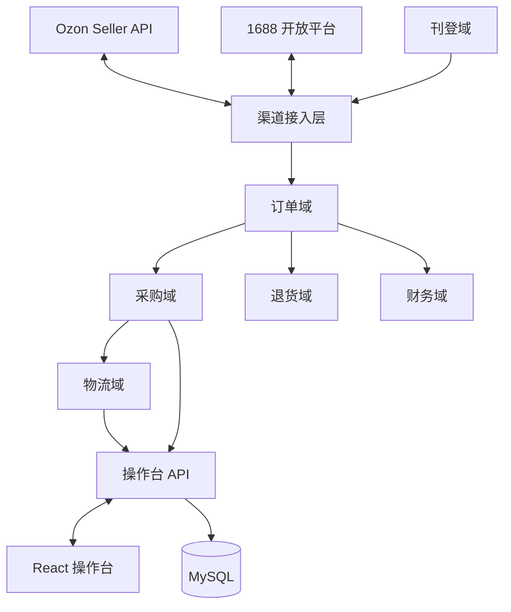

# spec-fulfillment-hub —— Ozon × 中国货源 · 履约中台（总 spec，一份装全）

> Issue: 待开（本 spec 合并后按波次开实施 issue，届时回填号）
> 状态：**v1.0**（2026-10-07 初稿）
> **设计权威 = 本文**——本仓只有这一份 spec，不拆子 spec；实施按波次拆 issue（2026-10-07 owner 拍板）。
> 立项日期：2026-10-07 ｜ 需求方：owner
> 技术栈（2026-10-07 owner 拍板）：**Go + GORM + MySQL**；操作台 **React**（组件库未定，见 §13）；**单机部署 + 同进程 worker**。
> 调研依据：本仓 [Issue #1](https://github.com/Strelizialeomon/ozon-dropship/issues/1)（两轮调研，含全部来源链接）。本文只放结论与设计；来源细节看 Issue #1 及其评论。

**证据分级**（外部事实的来源标注）：

| 标记 | 含义 |
|---|---|
| 【官方】 | 平台官方文档 / 官方帮助页（链接见 Issue #1） |
| 【第三方】 | 卖家社区 / ERP 文档口径，仅作线索 |
| 【未验】 | 尚无证据，落地前必须核实 |

---

## 1. 这个 spec 管什么

**管**：整套履约中台的设计——需求、总体架构、6 条机制、数据模型、渠道对接、操作台、验收标准、风险、波次与前置动作。

**不管**（出界）：

- 实施排期与人力分配——实施期在各波次的 issue 里谈
- 具体部署机器与网络方案——实施期定（见 §13）
- 前端组件库选型——未定（见 §13）
- 选品与定价策略——业务侧的事，系统只提供工具

---

## 2. 需求（owner 已确认）

### 2.1 业务背景

- 在 Ozon（俄罗斯主流电商平台）经营 **10+ 家店铺**（多执照矩阵）。
- 买家在 Ozon 下单后，从中国货源平台**串货/代发**（1688 / 拼多多 / 淘宝）。
- 现状：拉单 → 找货 → 下单 → 回填单号 → 售后的全链路靠人工搬运，量上来后撑不住。

### 2.2 需求清单

| # | 需求 | 出处 |
|---|---|---|
| R1 | Ozon 订单自动同步，支持 10+ 店 | owner 拍板 |
| R2 | 1688 **自动下单代发**（唯一有官方买家侧 API 的货源平台） | owner 拍板 + 调研 |
| R3 | 拼多多 / 淘宝**人工辅助**：系统备料 + 人工下单 + 单号回填 | owner 拍板 |
| R4 | 发货：物流单号回传 Ozon、面单、轨迹 | owner 拍板 |
| R5 | 退货处理流程（含仅退款 / 销毁等处置） | owner 拍板 |
| R6 | 财务对账（每单毛利） | owner 拍板 |
| R7 | 商品采集 / 刊登（1688 → Ozon） | owner 拍板 |
| R8 | **手动与自动双轨**——每类动作都有手动入口 | owner 原话「手动和对接我们都需要做」 |
| R9 | 发货模式兼容：rFBS / FBP / 俄本土店，按店配置 | owner「可能得都考虑」 |

### 2.3 明确不做（YAGNI，owner 2026-10-07 认可）

RPA / 爬虫（违规 + 封号）；自动改价跟卖；自建物流；移动端 App；多租户 SaaS（自用）；俄语翻译（人工或第三方工具）。

---

## 3. 外部能力现状（调研结论）

### 3.1 Ozon 侧：全链路 API 齐备【官方】

- 认证：每店一套 `Client-Id` + `Api-Key`（Seller Center → Settings → Seller API 自取）。
- 中国跨境店只有 **rFBS / FBP** 两种发货模式；FBO 不面向跨境；一张执照最多 **6 个账户**。
- 走 Ozon 官方物流时**轨迹自动回传**，无需自接承运商。
- 拉单接口有版本迭代（v3 拉单 2026-08-31 关停、财务旧接口 2026-09-08 关停）——对接时以官方文档现行版号为准。

### 3.2 1688 侧：唯一支持买家侧自动下单的货源平台【官方】

- 代发下单 `alibaba.trade.fenxiaoOrder.create`；一件代发 `fastCreateOrder`（flow=saleproxy）；跨境单 `createCrossOrder`。
- **企业实名必过**（营业执照 + 法人 + 对公账户）；下单类权限**按月续订**；代发前须与供应商建立分销关系。

### 3.3 拼多多 / 淘宝：无官方买家侧 API【官方】

- 淘宝帮助中心明示「不提供买家接入开发相关的 API」；拼多多开放平台无买家角色。
- → 这两家只能**人工辅助**：系统生成备料单，人工去平台下单，回填单号。

### 3.4 现成 ERP 对照（自研的基线）

- 妙手 / 店小秘 / 芒果 / 通途：都支持 Ozon 拉单 + 1688 代发，但**全是半自动**（采购下单需人工确认/付款）；无一支持「10+ 店全平台全自动」。
- 结论：owner 拍板**直接自研**（2026-10-07）。ERP 对照数据留在 Issue #1 作 Plan B。

---

## 4. 总体架构

- **形态**：Go 模块化单体，按域分包（目录分档照 `hi-backend` 判定器在实施期定，预判「按业务分包的单体」）；GORM 访问 MySQL；**worker 与服务同进程**；单机部署。
- **域划分**：
  - `channel/ozon`、`channel/alibaba`、`channel/manual`——三类渠道的 API 适配与差异封装
  - `order` / `purchase` / `shipment` / `returns` / `finance` / `listing`——六个业务域
  - `console`——操作台 BFF（HTTP API）
  - `platform`——横切：调度、限流、凭据保险箱、审计、通知、DB
- **数据流**：拉单 → 订单入库 → 匹配供应商映射 → 生成采购任务 → 执行（1688 自动 / 人工渠道备料）→ 获取单号 → 回传 Ozon → 轨迹跟踪 → 对账。

---

## 5. 机制（6 条，owner 2026-10-07「全要」）

### 5.1 采购任务（PurchaseTask）——统一「去哪买、谁去买」

- **对象**：`purchase_tasks`（一单可拆多任务：多供应商 / 多平台）。字段：order_id、supplier、executor_type(`auto`/`manual`)、payload（下单参数快照）、status、assignee、deadline。
- **状态机**：`pending → executing → ordered → paid → shipped → closed`；任一步失败或超时 → `exception`。
- **执行器**：`auto` = 1688 API 下单（S2 起含免密支付）；`manual` = 生成备料单给人工，人工执行后回填结果。
- **没有它会怎样**：手动/自动两套流程分叉，R8 双轨落不了地。

### 5.2 订单状态机 + 异常队列

- **状态**：`new → purchasing → purchased → shipped → in_transit → delivered → completed`；旁支 `cancelled` / `returned`。
- **异常判定（自动进池 + 通知）**：超时未采购；1688 下单失败；采购价变动超阈值；地址校验失败；发货截止（备货期最长可设 5 天【官方】）临近；物流轨迹停滞。
- **没有它会怎样**：日 200–1000 单靠人记状态必乱；异常单被淹没。

### 5.3 供应商映射 + 报价表

- **对象**：`supplier_offers`——Ozon `offer_id` ↔ 货源商品（平台、商品 ID、规格 ID、链接、采购价、境内运费、时效）。
- 下单时把当时价格**快照**进 `purchase_orders`，价格变动可追溯、可告警。
- **没有它会怎样**：每单人工找货比价，自动化无从谈起。

### 5.4 凭据保险箱

- 所有密钥（Ozon `Api-Key` × N 店、1688 应用密钥、数据库口令）**加密存储**：应用层 AES-GCM，主密钥从部署环境注入，**不进 git**。
- 按店隔离；操作台只显示脱敏尾号；读取与轮换记审计。
- **没有它会怎样**：密钥散落，泄一个全线崩。

### 5.5 轮询调度 + 限流重试

- 按店轮询拉单（默认间隔 5 分钟，见 §13）；令牌桶限流（Ozon 约 50 req/s/店【第三方】）；指数退避重试；按 `store_id + posting_number` **幂等 upsert**。
- **没有它会怎样**：手动刷单、触发限流甚至封禁。

### 5.6 对账口径

- 每单一条 `order_settlements`：`回款（RUB 按结算汇率折 CNY）− 采购成本 − 境内运费 − 头程/物流费 − 平台佣金 = 毛利`。
- 数据源：Ozon 财务只读 API【官方】、1688 订单实付、人工登记的物流费；**提现无 API，手工记录**【官方】。
- **没有它会怎样**：月底对不上账，赚亏全靠感觉。

---

## 6. 数据模型（核心表与关键字段）

| 表 | 关键字段 | 说明 |
|---|---|---|
| `stores` | id, name, mode(`rfbs`/`fbp`/`local`), client_id, status | 一店一行；模式决定走哪套拉单接口 |
| `credentials` | store_id, kind, secret_enc, rotated_at | 密文存储（§5.4） |
| `supplier_offers` | ozon_offer_id, platform, item_id, sku_id, purchase_price, freight, url, status | 映射 + 报价（§5.3） |
| `orders` | store_id, posting_number, status, ship_deadline, buyer_enc, amounts | 唯一键 `store_id + posting_number`（幂等） |
| `order_items` | order_id, offer_id, qty, price, supplier_offer_id | |
| `purchase_tasks` | order_id, supplier, executor_type, status, payload, assignee, deadline | §5.1 |
| `purchase_orders` | task_id, supplier_order_id, amount, paid_at, tracking_no | 含价格快照 |
| `shipments` | order_id, carrier, tracking_no, ozon_ship_status, label_ref, events | |
| `return_requests` | order_id, ozon_return_id, status, disposition, refund_amount | §R5 |
| `finance_transactions` | store_id, ozon_txn_id, type, amount_rub, amount_cny, happened_at | §5.6 数据源 |
| `order_settlements` | order_id, revenue, cost, freight, commission, gross_profit, reconciled_at | §5.6 |
| `audit_logs` | actor, action, object, detail, at | 全量操作留痕 |
| `users` | name, role(`admin`/`operator`), status | 两级角色起步 |

（完整 DDL 属实施期；本节定义关键字段与唯一键，实施不得偏离。）

---

## 7. 渠道对接要点

### 7.1 Ozon（每店一套凭据；接口以官方文档现行版为准）

| 动作 | 接口 |
|---|---|
| 拉单（FBS/rFBS） | `/v4/posting/fbs/list`（v3 已于 2026-08-31 关停）、`/v4/posting/fbs/unfulfilled/list`、`/v3/posting/fbs/get` |
| 拉单（FBP） | `/v1/posting/fbp/list`、`/v1/posting/fbp/get` |
| 确认发货 | `/v4/posting/fbs/ship`、`/v4/posting/fbs/ship/package` |
| 传单号 | `/v2/fbs/posting/tracking-number/set`；自送轨迹 `/v2/fbs/posting/delivering` → `/last-mile` → `/delivered` |
| 面单 | `/v2/posting/fbs/package-label`（同步 PDF） |
| 取消 | `/v2/posting/fbs/cancel` |
| 退货 | `/v1/returns/list`；rFBS：`/v2/returns/rfbs/list`、`/v1/returns/rfbs/action/set` |
| 财务（只读） | `/v1/finance/accrual/*`（旧 `/v3/finance/transaction/list` 2026-09-08 关停） |
| 刊登 | `/v3/product/import` |
| 物流方式 | `/v1/delivery-method/list` |

注意事项：2025-05-16 起禁浏览器直连（CORS）；限流约 50 req/s/Client-Id【第三方】。**本土店（local）接口差异待摸底**【未验】——实施前必须先跑通一家真实店。

### 7.2 1688 开放平台

- **下单**：`alibaba.trade.fenxiaoOrder.create`（代发，传下游渠道 + 下游单号 + 收货地址）；`alibaba.trade.fastCreateOrder`（一件代发 flow=saleproxy）；`alibaba.trade.createCrossOrder`（跨境单）。
- **推单族**：`fenxiao.linkorder.add/batchAdd/cancel/getSupplierList/getBuyerOrderList`。
- **配套**：`alibaba.createOrder.preview`（下单预览）、`alibaba.trade.pay.protocolPay.*`（免密支付，S2 用）、`alibaba.trade.addresscode.parse`（地址解析）、`alibaba.trade.getLogisticsInfos.buyerView`（物流信息）。
- **前置**：企业实名 + 下单权限申请（按月续订）+ 与供应商建分销关系。**这项不依赖代码，尽早启动**（见 §12）。

### 7.3 人工渠道（拼多多 / 淘宝）

- **备料单**内容：商品链接、规格、数量、收件人信息（真实信息，供人工下单用；界面按权限展示）、备注、期望时效。
- **回填**：平台订单号、实付金额、物流单号；系统校验单号格式并抽检可达性。
- **不做**：任何形式的自动下单 / RPA（§2.3）。

### 7.4 物流

- 优先走 **Ozon 官方物流**（轨迹自动回传，§3.1）；自选承运商（如 CDEK，有官方 API【官方】）仅作备选。
- 面单：FBS 面单走 Ozon API 获取；人工渠道的面单 / 货代流程沿用现状。

---

## 8. 操作台（双轨的手动侧）

- **页面**：订单工作台（列表 / 筛选 / 详情 / 批量）/ 采购任务台 / 异常池 / 映射与报价 / 店铺与凭据 / 退货 / 财务 / 刊登。
- **双轨原则**：每个自动化动作都有手动等价入口；手动动作同样留审计。自动化是「可开关的加速器」，不是黑箱。
- **角色**：`admin` / `operator` 两级起步。
- **前端**：React（组件库未定，见 §13）；调 `console` 域 API。

---

## 9. 验收标准（按波次）

### S1 地基 + 单店端到端闭环

- [ ] 单店 Ozon API 拉单成功、按 `posting_number` 去重、新单可见
- [ ] 工作台能完成：查看订单 → 生成采购任务 → 1688 API 下单（人工确认付款）→ 回填单号 → 回传 Ozon → 获取面单
- [ ] 拼多多 / 淘宝备料单可生成、可回填、格式校验生效
- [ ] 全程操作有审计日志；凭据加密存储
- 指标：拉单延迟 ≤ 10 分钟；单号回传（含重试）成功率 ≥ 99%

### S2 多店规模化 + 1688 全自动

- [ ] 10+ 店并发轮询运行 7 天无重大故障；日 1000 单压测通过
- [ ] 1688 免密支付自动下单，成功率 ≥ 95%，失败全部进异常池
- [ ] 采购价变动超阈值时自动暂停并告警

### S3 物流深化 + 退货域

- [ ] 面单获取与轨迹三段（delivering / last-mile / delivered）自动更新
- [ ] 退货单自动同步；仅退款 / 销毁 / 退仓处置流程可执行、留痕

### S4 财务对账 + 采集刊登

- [ ] 每单毛利可算，与 Ozon 结算数据对账差异 ≤ 1%
- [ ] 1688 采集 → Ozon 上架在单店跑通

---

## 10. 风险与坑（如实标，不粉饰）

1. **1688 资质与续订**：企业实名审核、下单权限按月续订——断续约即断链路【官方】；服务商形态另有聚石塔等要求，自用形态的权限边界**待向 1688 官方核实**【未验】。
2. **网络**【未验】：服务器直连 `api-seller.ozon.ru` 的质量（延迟 / 稳定性）未实测；实施第一步就验。
3. **取消率红线**：卖家原因取消率 > 40% 封号 3 天【官方】——系统必须把「无法履约」的判定做在取消之前（走异常池而非直接取消）。
4. **备货期 vs 采购时效**：rFBS 备货期最长 5 天【官方】，而拼多多 / 淘宝采购 + 到货代常需 2–4 天——人工渠道单必须优先处理，系统要按 deadline 排序告警。
5. **退货物理现实**：跨境退回中国成本高，实际以「仅退款 / 销毁」为主——系统管流程与记账，管不了物理退回。
6. **提现无 API**【官方】：回款提现只能人工后台操作，系统只做记录与提醒。
7. **PII**：俄买家姓名 / 电话 / 地址经系统流转——静态加密、按角色最小可见、操作留审计。
8. **免密支付风险**（S2）：价格变动、重复支付——幂等键 + 金额上限 + 支付前二次校验。
9. **GORM**：迁移脚本与慢查询需在实施期立规矩（评审 migration、关键查询 EXPLAIN）。

---

## 11. 不在本次范围

同 §2.3：RPA / 爬虫、自动改价跟卖、自建物流、移动端、多租户、俄语翻译（人工 / 第三方工具）。

---

## 12. 落地步骤（波次 + 前置动作）

### 12.1 前置动作（不依赖代码，尽早启动）

1. **1688 开放平台**：企业实名 + 下单权限申请（审核约 1–3 个工作日、按月续订）
2. **Ozon**：收集 10+ 店的 `Client-Id` / `Api-Key`；确认各店发货模式（rFBS / FBP / 本土店）
3. **基础设施**：Linux 服务器 + MySQL；验证服务器直连 Ozon / 1688 API 的网络质量（§10.2）

### 12.2 波次

| 波 | 内容 | 验收 |
|---|---|---|
| **S1** | 地基（多店模型 + 凭据 + 调度）+ 单店端到端闭环（含人工渠道备料单） | §9·S1 |
| **S2** | 10+ 店规模化 + 1688 全自动（免密支付 + 异常队列驱动） | §9·S2 |
| **S3** | 物流深化（面单 / 轨迹）+ 退货域 | §9·S3 |
| **S4** | 财务对账 + 采集刊登 | §9·S4 |

实施拆分：**spec 不拆，按波次拆 issue**——本 spec 合并后开 S1 issue，后续波次依次开（各自锚本文永久链接）。

---

## 13. 自定细节（spec 没写死、实施期定的）

- 前端组件库选型（owner 未定）
- 部署机器与网络方案（含是否走内网 / 域名）
- 轮询默认间隔（暂定 5 分钟，压测后调）
- 免密支付限额与总开关（S2 定）
- 通知渠道（先站内通知 + 可插拔接口；企微 / 飞书待定）
- PII 脱敏粒度（按角色定义字段可见性）
- 日志与备份保留期
- Go 目录分档（按 `hi-backend` 判定器，实施期判）

---

## 14. 审核修订记录

（审核完成后追加：# / 严重度 / 发现 / 处置）
